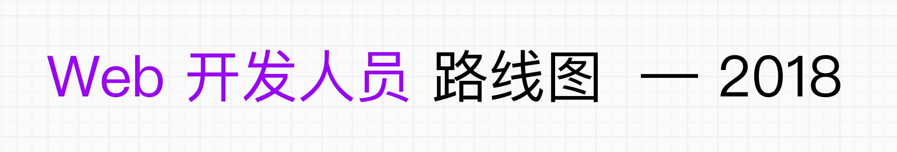
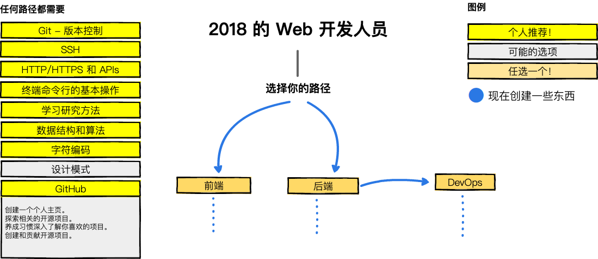
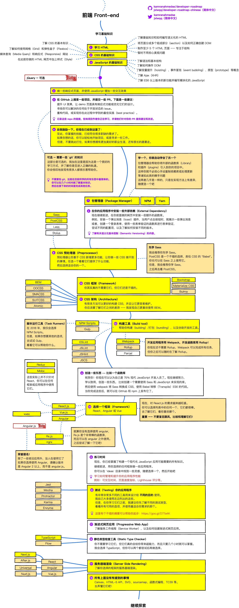
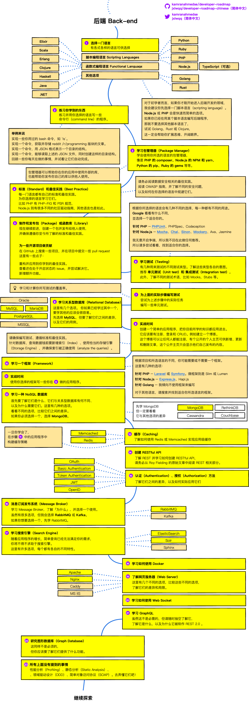
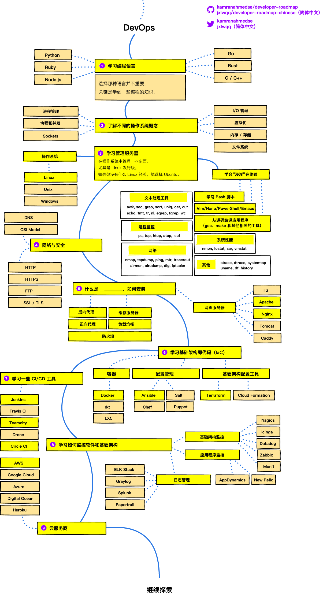

[English](https://github.com/kamranahmedse/developer-roadmap) | [繁體中文](https://github.com/goodjack/developer-roadmap-chinese) | [简体中文](https://github.com/jxlwqq/developer-roadmap-chinese)

> 2018 年成为 Web 开发人员的路线图

下面是一组图表，展示了您可以采取的路径以及希望采用的技术，以便成为前端，后端或 [DevOps](https://zh.wikipedia.org/wiki/DevOps) 开发人员。 我为我的一位老教授制作了这些图表，他希望与他的大学生们分享一些观点。

欢迎逛逛我的[博客](http://kamranahmed.info)，或者来 [Twitter](https://twitter.com/kamranahmedse) 打个招呼。

## 免责声明

本路线图的目的是给你一个轮廓，并在你困惑接下来该学什么的时候指导你。而不是鼓励你学习很新潮、很流行的东西。你应该要更加了解，在一些情况，为什么某个工具会比其他的工具更适合。记住新潮、流行的东西，从来就不代表它是最适合完成任务的工具。

## 🚀 介绍

## 🎨 前端 Frontend 路线图

## 👽 后端 Back-end 路线图

## 👷 DevOps 路线图

## 🚦 总结

如果你人为路线图有可以改进的地方，请更新并提交 PR 或是新建 Issue。另外，我也会继续改进这个项目，所以你可能会想要 Watch 或 Star 这个项目以便再次访问。

## ☑ TODO 列表

- [X] 新增前端 Frontend 路线图
- [X] 新增后端 Backend 路线图
- [X] 新增 DevOps 路线图
- [ ] 为每个項目新增相关资源

## 👬 贡献

这些路线图是用 [Balsamiq](https://balsamiq.com/products/mockups/) 构建的。项目文件可以在 `/project` 目录中找到。要修改任何路线图，请打开 Balsamiq，点击 **Project > Import > Mockup JSON**，它就会帮你开启路线图，更新它，在 readme 中上传和更新这些图片，并提交一个 PR。

- 改进并提交 Pull Request
- 在 Issue 中讨论想法
- 分享出去
- 接受任何意见与反馈 

## 赞助

- [Hackr.io - Find & Share the Best Online Programming Courses & Tutorials](https://hackr.io)

## 授权条款

